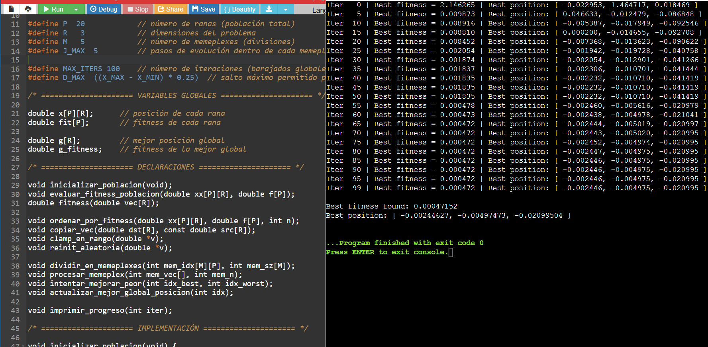

# Sphere benchmark — theory, SFL behavior, and how to read a run

This note goes deeper than the README. It formalizes the Sphere objective, explains the
Shuffled Frog-Leaping (SFL) loop used here, maps ideas to the C code, and walks through the
output of a real run (your screenshot).

---

## 1) Objective: Sphere

In $\mathbb{R}^d$ the Sphere function is

$$
\operatorname{Sphere}(\mathbf{x})=\sum_{i=1}^{d} x_i^2.
$$

It’s convex, strictly unimodal, and separable. The unique global minimizer is
$\mathbf{x}^\*=\mathbf{0}$ with $f(\mathbf{x}^\*)=0$. Because the landscape is smooth and
bowl-shaped, it’s the right place to sanity-check whether an optimizer actually contracts
toward the true solution.

---

## 2) SFL in 30 seconds

- Start with a population of $P$ frogs (candidate solutions).  
- Sort by fitness and split round-robin into $M$ **memeplexes**.  
- Inside each memeplex, improve the **worst** frog a few times (`J_MAX` steps):  
  1) try a jump toward the **memeplex best**;  
  2) if no improvement, try a jump toward the **global best**;  
  3) if still nothing, random reinit within bounds.  
  Each jump is **clamped** (bounds) and **capped** per component (by `D_MAX`).  
- Shuffle (re-sort, re-split), repeat.

On a smooth convex surface like Sphere, this plays out as steady tightening around the origin.

---

## 3) Where that logic lives in the code

- Bounds & dims: `X_MIN`, `X_MAX`, `R`  
- Population: `x[P][R]`, `fit[P]`  
- Global best: `g[R]`, `g_fitness`  
- Loop parameters: `P`, `M`, `J_MAX`, `MAX_ITERS`, `D_MAX`  
- Objective: `fitness()` implements Sphere  
- Round-robin split: `dividir_en_memeplexes(...)`  
- Local search on worst: `procesar_memeplex(...)` → `intentar_mejorar_peor(...)`  
- Jump rules: memeplex-best → global-best → random reinit  
- Bounds/step handling: `clamp_en_rango(...)` + per-component cap `D_MAX`

---

## 4) Parameter notes (practical)

- **Population** `P=20` and **memeplexes** `M=5` keep groups small but diverse.  
- **Local steps** `J_MAX=5` is a good compute/quality tradeoff for demo size.  
- **Step cap** `D_MAX=0.25*(X_MAX - X_MIN)` avoids wild moves; near the optimum the jump
  size is naturally small because the `best − worst` difference is small.  
- **Iterations** `MAX_ITERS=100` is plenty for Sphere in low dimension.

> Want finer late improvements? A few options: bump `J_MAX` to 7–10, raise `P` a bit (e.g.,
> 30), or add a small termination threshold (stop when best fitness < ε).

---

## 5) Results: what a healthy run looks like

This is a typical trace:

- At **Iter 0** the best fitness is around **2.146265** with a best position like  
  `[ -0.022953, 1.467417, 0.018469 ]` — clearly far from the origin.  
- As memeplexes iterate, fitness drops quickly (e.g., *8.45e-4* around Iter 20–30) and then
  keeps nudging down.  
- By Iter **60** onward the run sits near **4.72e-4**, with best position close to zero:  
  `[ -0.002446, -0.004975, -0.020995 ]`.

You can sanity-check the final number by squaring each coordinate and adding:

- $(-0.002446)^2 \approx 5.98\times10^{-6}$  
- $(-0.004975)^2 \approx 2.48\times10^{-5}$  
- $(-0.020995)^2 \approx 4.41\times10^{-4}$

Sum $\approx 4.72\times10^{-4}$, which matches the printed fitness.
That’s exactly what we want on Sphere: a clean contraction toward **0**.

**Why the “plateau” near the end?**  
Late in the run the population is already clustered and the “worst” frog is only a hair
worse than the best. Jumps become tiny and improvements can stall at the print precision
(we print every 5 iters and to 6 decimals). If you need to squeeze the last digits:
increase `J_MAX` or `P`, or add a simple early-stop when `best_fitness` < ε.

---

## 6) Complexity (per outer iteration)

- Sorting population: $O(P^2)$ here (simple selection sort; fine for small $P$).  
- Fitness: $O(P\cdot R)$.  
- Local search: about $O(M\cdot J_{\max}\cdot R)$ since we update just the **worst**.

For demo settings this runs essentially instant.

---

## 7) Next steps

- Try more challenging functions (Rosenbrock, Rastrigin) to see how SFL handles nonconvexity.  
- Add CLI flags for `P`, `M`, `J_MAX`, `R`.  
- Introduce an $\varepsilon$ stop or “no-improvement” counter.

